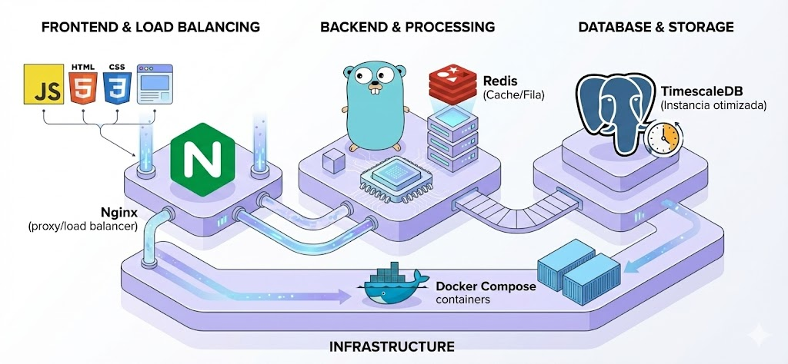
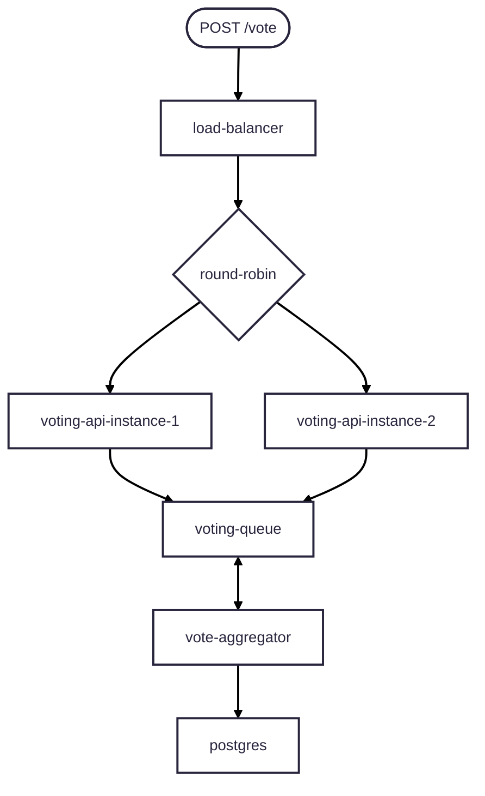
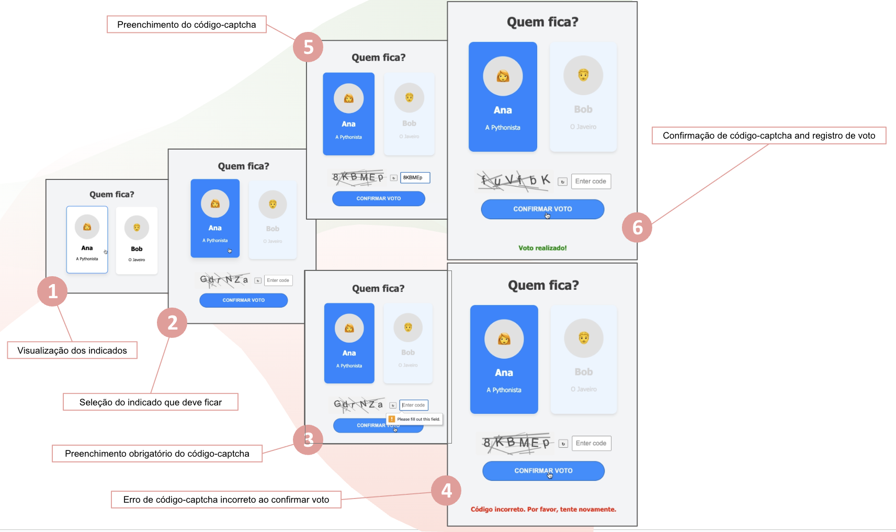
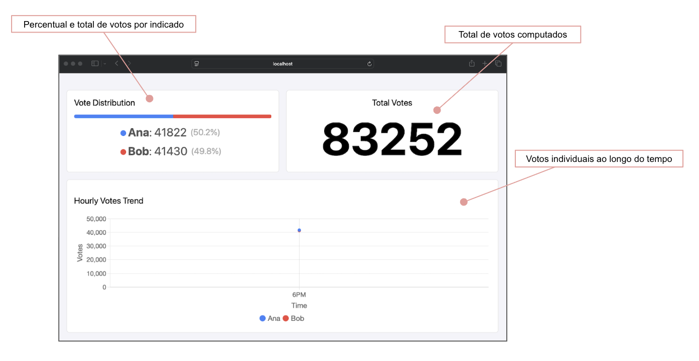
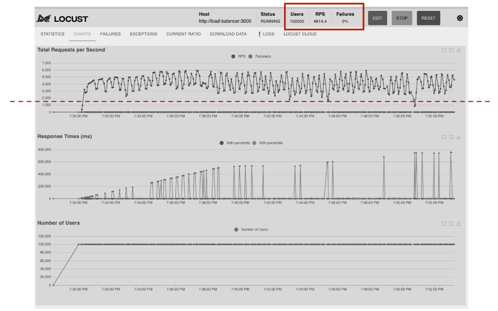

# Laager Assessment 1 - Sistema de Votação (BBB Eviction)

Este projeto implementa um sistema de votação de alta performance, inspirado nos mecanismos de "paredão" do Big Brother Brasil (BBB). O objetivo é processar votos de forma escalável, permitindo também a consulta de estatísticas em tempo real.

## Tecnologias Utilizadas

<p align="center">
      
</p>

- Linguagem: Go (Golang)
- Banco de Dados: PostgreSQL (instancia otimizada com timescaledb)
- Cache/Fila: Redis
- Proxy/Load Balancer: Nginx
- Frontend: JavaScript, HTML, CSS
- Infraestrutura: Docker & Docker Compose

## Arquitetura e Fluxos

O sistema é dividido em três fluxos principais para garantir performance e consistência:

### 1. Votação
Processa o voto do usuário e o enfileira para contabilização assíncrona.

<details open>
      <summary> Fluxo de voto </summary>



</details>

### 2. Analytics Horário

Recupera dados consolidados por hora diretamente do banco de dados persistente.

<details open>
      <summary> Fluxo de consulta das estatísticas por hora. </summary>


</details>

### 3. Estatísticas do Paredão

Consulta o estado atual da votação, geralmente acessando dados em cache (Redis) para rapidez.


<details open>
      <summary> Fluxo de consulta das estatísticas da votação </summary>


</details>


## Como Executar

O projeto utiliza `Docker` para orquestração dos serviços e um `Makefile` (opcional) para automação de tarefas de build/execução.

### Pré-requisitos

- Docker e Docker Compose instalados/configurados.

#### Passos

1. Clone o repositório:

```bash
git clone https://github.com/jefersonf/b3-eviction.git
cd b3-eviction
```

2. Suba os serviços: Utilize o Docker Compose para iniciar a aplicação, banco de dados, redis e nginx.

```bash
docker-compose up -d
```
Alternativamente, e o autor RECOMENDA, podes subir os serviços via Makefile pela praticidade, pois o comando a seguir constroi e executa a aplicação, isto é, equivale `make build` seguido de `make run` (checar arquivo Makefile).

```bash
make
```

1. Acesse a aplicação: O serviço deve estar acessível através das portas configuradas para acesso externo ao Docker Compose. São três os serviços ao todo:
   - Frontend (`localhost:3000`)
   - Nginx/LoadBalancer/Entrypoint da API (`localhost:8080`) e
   - Loscust (`localhost:8089`), serviçõ extra para fins de testes de alto volume de requisiões contra a API da votação.


## Documentação da API

|Verbo HTTP|Recurso|Descrição Simples|
|-|-|-|
|`POST`|`/vote`|Solicita um registro de um voto em um dos indicados.|
|`GET`|`/stats/`|Retorna informação sobre a saúde da API de votação.|
|`GET`|`/stats/{evictionId}`|Retorna as estatísticas de um paredão específico.|
|`GET`|`/analytics/hourly`|Retorna o sumário de votos totais e por cada indicado a cada hora nas últimas 24 horas.|
|`GET`|`/analytics/minutely`|Retorna o sumário de votos totais e por cada indicado a cada minuto nas últimas 24 horas.|

## Documentação da UI (Área de votação + Dashboard)

A interface de usuário tanto para votação quanto para quem assume o papel de administrador do dashboard, compreende duas visões, área de votação e o dashboard de estatísticas de votação.

### 1. Área de votação

<p align="center">
      
</p>

### 2. Dashboard para acompanhamento das votação ao vivo.

<p align="center">
      
</p>

## Testes de performance

### Stress test com Locust

Configuração e screenshort do teste de carga mais severo.

No geral a solução lidou bem na primeira hora de execução, mas atingiu 100% dos recursos de CPU e memória (~8GB) alocados. Um RPS médio de ~4600 fio atingido.

A execução foi interrompida por um crash no Docker daemon :'(.

<p align="center">
      
</p>

Endpoint: `POST /vote`
Configuração:
- Até 100 mil usuários simultâneos (no pico).
- Até 10 mil requisições por minuto

## Armazenamento dos dados

### Redis (in-memory/cached)

- Sumário da votação em memória contendo `global_count_votes` para votos totais em tempo real e `votes:<eviction-id>:<nominee-id>` para contagem de votos individuais.

### Postgres

Para armazenar os votos utilizei uma instância otimizada do Postgres chamada 'TimescalaDB'. A seguir a schema utilizada, Table e View, respectivamente.

- `votes_minutely` - Tabela de votos agregados e consolidados por minuto.
- `votes_hourly` - Tabela de visão de votos agregados e consolidados por hora.

## Demos

- [UI + Load Testing](https://youtu.be/TwWtG-HLu-s)
- [Backend Schema and Cached Votings Stats](https://youtu.be/zFZKWlS341s)